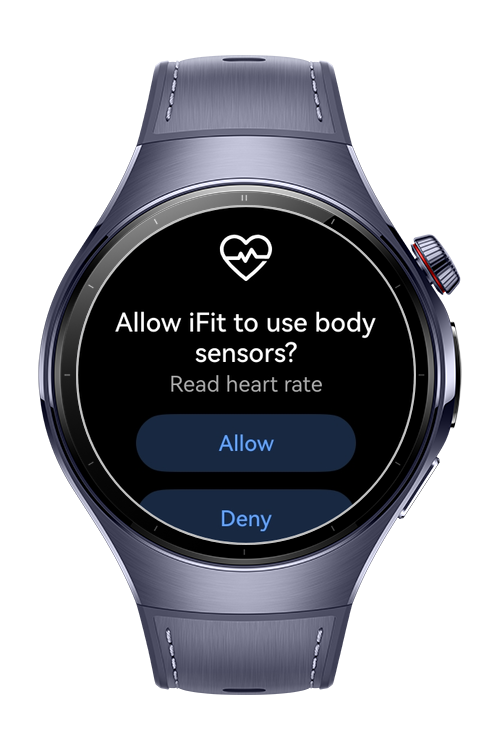
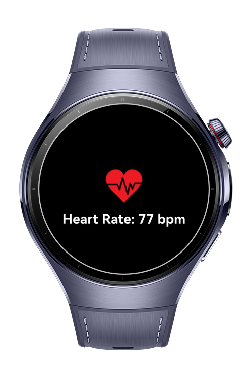

> **Note:** To access all shared projects, get information about environment setup, and view other guides, please visit 

# How-To-Heart-Rate-with-Body-Sensor
In this app, real-time heart rate monitoring was implemented by using Huawei's Sensor Kit. The sensor continuously fetches the user's heart rate data and displays it on the screen in real-time. By integrating the Sensor Service Kit, the app listens for heart rate sensor events, processing them as they occur.

# Preview

<div>


</div>

# Use Cases

The flow includes:

1. Permission Request: The app requests to use body sensor to read heart rate.

2. Sensor Subscription: Once permissions are granted, the app subscribes to the heart rate sensor and begins receiving heart rate data at regular intervals.

3. Real-Time Updates: The heart rate is updated dynamically, and the current value is displayed on the UI, providing users with continuous feedback on their heart rate.

This functionality leverages Huawei’s Sensor Kit to provide an accurate and responsive heart rate monitoring system, which can be used in health and fitness applications to track heart rate trends in real time.

Additionally, Particle animation was used to add visual richness to the background.

# Tech Stack
- **Languages**: ArkTS
- **Frameworks**: HarmonyOS SDK 5.1.0(18)
- **Tools**: DevEco Studio Vers 5.1.0.842
- **Libraries**:
    - `@kit.ArkUI`
    - `@kit.SensorServiceKit`
    - `@kit.BasicServicesKit` 
    - `@kit.PerformanceAnalysisKit`
  
# Directory Structure

   ```
entry/src/main/ets/
|---pages
|---|---Index
|---utils
|---|---PermissionsUtil
|---entryability
|---|---EntryAbility
|---entrybackupability
|---|---EntryBackupAbility
   ```
# Constraints and Restrictions

## Supported Devices

- Huawei Watch 5

## Permissions

ohos.permission.READ_HEALTH_DATA

# License

**How to Get Heart Rate with Sensor Services Kit?** is distributed under the terms of the MIT License
See the [license](./LICENSE) for more information.
